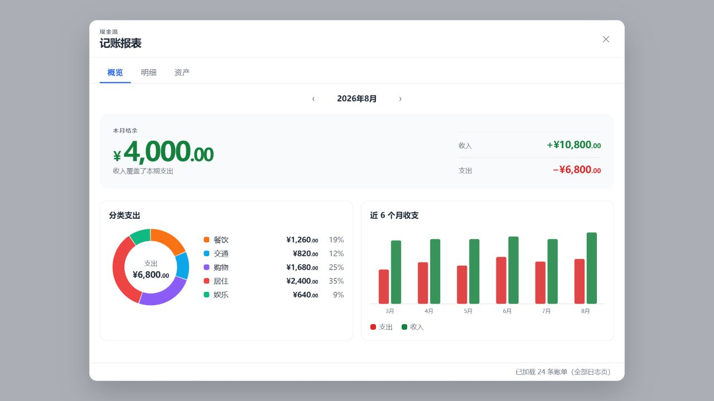
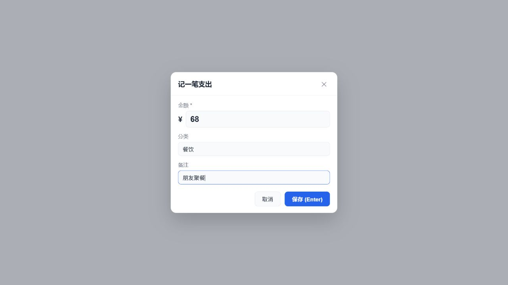
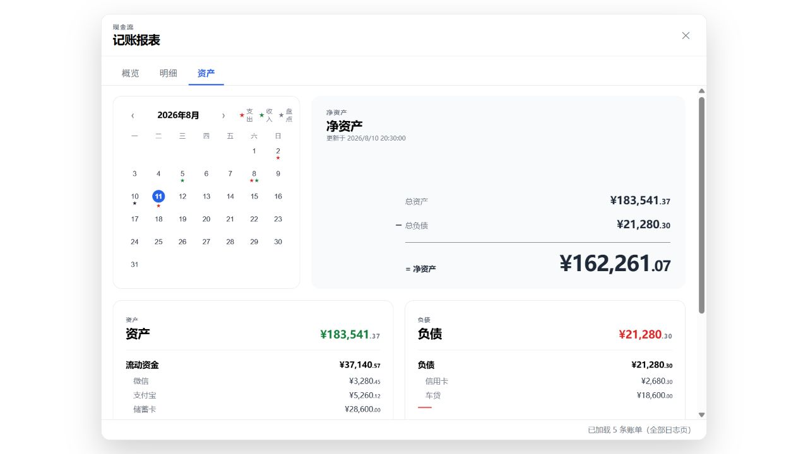

# Ledger & Worth

*Journal accounting and net worth tracking for Logseq DB graphs.*

Ledger & Worth keeps daily income and expenses in your Logseq journal, turns them into a monthly cash-flow dashboard, and records point-in-time asset and liability snapshots. All financial records remain ordinary blocks and DB properties inside your graph.

> Requires a **Logseq DB graph**. File-based Markdown/Org graphs are not supported.

## Highlights

- `/expense` and `/income`: record an amount, category, and note from the current journal block.
- `/assets`: open a full balance check with editable asset and liability groups.
- `/report`: review monthly cash flow, searchable transactions, a finance calendar, and net worth.
- Chinese and English interface options, configurable commands, currency symbol, decimal places, and semantic colors.
- Light and dark theme support.
- No external account, cloud database, or runtime chart dependency.

## Screenshots

### Monthly cash-flow dashboard / 月度收支概览



### Quick transaction entry / 快速记录收支



### Assets dashboard / 资产页面



## Install from a release

1. Download the ZIP from [Releases](https://github.com/killain-best/logseq-accounting/releases).
2. Extract it to a permanent folder.
3. In Logseq desktop, enable Developer mode under **Settings → Advanced**.
4. Open **Plugins**, choose **Load unpacked plugin**, and select the extracted folder.

## Build locally

```bash
npm install
npm run build
```

Load the project root with **Load unpacked plugin**. After changing code, run `npm run build` again and reload the plugin in Logseq.

## Commands

| Default command | Action |
|---|---|
| `/expense` | Record an expense |
| `/income` | Record income |
| `/assets` | Create an asset and liability snapshot |
| `/report` | Open the accounting dashboard |

Command names can be changed in the plugin settings. Reload the plugin after changing them.

## 中文说明

Ledger & Worth 在 Logseq **日志页**内记录收支，用月度报表整理现金流，并通过资产盘点保存每个时间点的资产、负债与净资产。账单和快照都保存在当前 graph 中，不依赖外部账户或云服务。

### 主要功能

- **`/expense`、`/income`**：填写金额、分类和备注，在当前日志位置生成结构化账单。
- **`/assets`**：打开资产盘点界面，可自行添加、重命名或删除资产与负债的父类、子类；保存后在当日日志生成快照。
- **`/report`**：打开记账报表。
  - 概览：本月支出、收入、结余、分类构成与近 6 个月趋势。
  - 明细：搜索、筛选并按日期或金额排序，点击一条流水可跳回日志原块。
  - 资产：财务日历、净资产公式和最近一次资产负债构成。
- 使用说明位于插件设置页，启动时不会弹出教学窗口。
- 支持亮色和暗色主题。

### 数据规则

- 每笔账是带 `#账单` 标签的日志块；日期取块所在日志页的日期。
- 账单使用 `txn_amount`、`txn_type`、`txn_category` 等 DB 属性保存；已有 `txn_account` 数据继续兼容。
- 非日志页里的账单块不计入报表。
- 删除账单块等于删除该笔账；直接修改属性后，报表会自动刷新。
- 每次资产盘点保存为带 `#资产盘点` 标签的日志块。后来重命名或删除盘点项目，不会改写过去的快照。

### 可自定义项目

| 项目 | 默认值 |
|---|---|
| 界面语言 | 中文，可切换 English |
| 币种符号 | `¥` |
| 小数位数 | `2`，可选 0–4 |
| 支出 / 收入 / 资产盘点颜色 | 红 / 绿 / 黄，支持 CSS 颜色值 |
| 指令 | `/expense`、`/income`、`/assets`、`/report` |
| 支出分类 | 餐饮、交通、购物、居住、娱乐、医疗、教育、其他 |
| 收入分类 | 工资、奖金、理财、兼职、其他 |

## Development

Use a current Node.js LTS release or newer. Before committing or loading a development build, run:

```bash
npm run check
```

This runs strict TypeScript checking, Oxlint, Vitest, and the production build. The full manual Logseq checklist is in [MANUAL_TESTING.md](./MANUAL_TESTING.md).

## Technology

TypeScript, React 19, Vite, handwritten SVG charts, and the Logseq Plugin SDK (DB properties and Datascript queries).

## License

[MIT](./LICENSE)
